# 水电费抄收管理系统
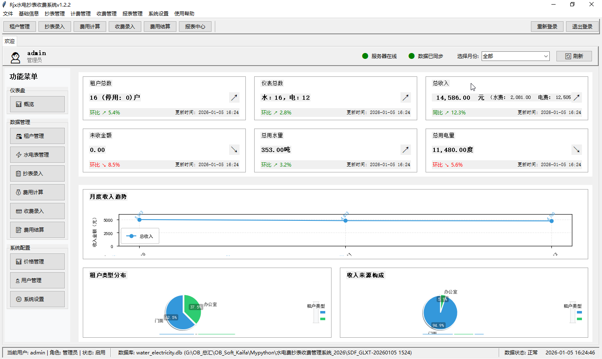

## 文档说明

**文档版本**：V1.0
**更新日期**：2026-01-05
**适用系统**：水电费抄收管理系统
**文档类型**：软件介绍与操作手册

## 目录

1. [软件介绍](#1-软件介绍)
   1.1 [项目背景](#11-项目背景)
   1.2 [核心功能](#12-核心功能)
   1.3 [技术架构](#13-技术架构)
   1.4 [适用人群及环境要求](#14-适用人群及环境要求)
   1.5 [系统个性特色](#15-系统个性特色)

2. [操作手册](#2-操作手册)
   2.1 [系统安装部署流程](#21-系统安装部署流程)
   2.2 [用户注册与登录步骤](#22-用户注册与登录步骤)
   2.3 [功能模块操作说明](#23-功能模块操作说明)
      2.3.1 [租户管理](#231-租户管理)
      2.3.2 [水电表管理](#232-水电表管理)
      2.3.3 [价格管理](#233-价格管理)
      2.3.4 [抄表管理](#234-抄表管理)
      2.3.5 [费用计算](#235-费用计算)
      2.3.6 [收费管理](#236-收费管理)
      2.3.7 [结算管理](#237-结算管理)
      2.3.8 [用户管理](#238-用户管理)
      2.3.9 [报表中心](#239-报表中心)
   2.4 [常见问题处理及故障排除](#24-常见问题处理及故障排除)
   2.5 [数据备份与恢复](#25-数据备份与恢复)

3. [术语解释](#3-术语解释)

4. [附录](#4-附录)
   4.1 [快捷键说明](#41-快捷键说明)
   4.2 [系统更新日志](#42-系统更新日志)

---

## 1. 软件介绍

### 1.1 项目背景

随着物业管理行业的快速发展，传统的手工抄表、计费、收费方式已无法满足现代管理需求。人工操作存在效率低下、容易出错、数据统计困难等问题，给物业管理带来了诸多挑战。

水电费抄收管理系统应运而生，旨在通过信息化手段，实现从抄表、计费到收费结算的全流程自动化管理，提高工作效率，减少人为错误。更为重要的是，管理者难以从海量数据中提取有价值的经营信息，决策缺乏有效的数据支撑。这些痛点不仅制约了物业服务质量的提升，也影响了企业的运营效率和经济效益。

### 1.2 核心功能

| 模块名称  | 主要功能                          |
| ----- | ----------------------------- |
| 租户管理  | 租户信息的增删改查、租户分类管理、租户状态管理       |
| 水电表管理 | 水电表的注册、分配、维护和状态管理             |
| 价格管理  | 灵活设置不同类型租户的水价、电价，支持价格调整和历史记录  |
| 抄表管理  | 记录和管理水电表读数，支持手工录入和批量导入        |
| 费用计算  | 根据抄表数据和价格自动计算租户费用，生成费用清单      |
| 收费管理  | 记录租户缴费情况，支持多种缴费方式，自动更新费用状态    |
| 结算管理  | 月度结算，生成结算报表，支持Excel导出         |
| 用户管理  | 系统用户权限控制，支持多角色管理              |
| 数据导出  | 支持将各种数据导出为Excel格式，便于数据分析和报表生成 |
| 国际化支持 | 支持中英文切换，适应不同用户需求              |

### 1.3 技术架构

#### 1.3.1 系统架构

水电费抄收管理系统采用分层架构设计，各层级职责明确，边界清晰，便于系统扩展和维护。系统架构从下至上分为数据存储层、数据访问层、业务逻辑层和表现层四个主要层级，每层内部组件之间通过明确定义的接口进行通信。

##### 1.3.1.1 分层架构图
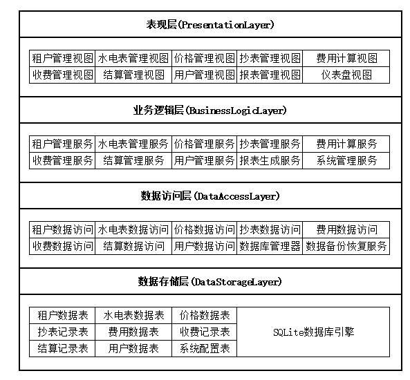


##### 1.3.1.2 各层级功能边界与交互机制

| 层级        | 主要职责                 | 核心组件                     | 交互机制                          |
| --------- | -------------------- | ------------------------ | ----------------------------- |
| **表现层**   | 处理用户交互，展示数据，接收用户输入   | 各种功能模块视图、仪表盘、报表生成器       | 通过调用业务逻辑层的服务接口实现数据交互，采用事件驱动模式 |
| **业务逻辑层** | 实现核心业务逻辑，处理业务规则      | 各业务模块服务类、业务规则引擎、工作流管理器   | 通过数据访问层获取和存储数据，通过接口调用实现模块间协作  |
| **数据访问层** | 封装数据访问逻辑，提供统一的数据访问接口 | 各实体的数据访问类、数据库连接管理器、事务管理器 | 直接与数据库交互，执行SQL操作，实现数据的CRUD操作  |
| **数据存储层** | 持久化存储系统数据            | SQLite数据库、数据表、索引         | 通过数据库引擎接收SQL命令，执行数据存储和检索      |

##### 1.3.1.3 核心模块内部结构

1. **抄表管理模块**
   - **输入组件**：抄表数据录入表单、批量导入工具
   - **处理组件**：读数验证器、用量计算器、异常检测引擎
   - **输出组件**：抄表记录列表、异常报表、手抄单生成器

2. **费用计算模块**
   - **输入组件**：费用计算参数配置、抄表数据
   - **处理组件**：价格查询引擎、费用计算公式库、费用分配器
   - **输出组件**：费用清单、费用明细报表、异常费用预警

3. **收费管理模块**
   - **输入组件**：缴费记录录入表单、缴费凭证模板
   - **处理组件**：缴费验证器、费用状态更新器、凭证生成器
   - **输出组件**：收费记录列表、收费统计报表、收费凭证

##### 1.3.1.4 关键业务流程架构实现

1. **抄表到费用计算流程**
   ```
   表现层：抄表管理视图 → 输入抄表数据
   业务逻辑层：抄表管理服务 → 验证数据 → 存储记录 → 触发费用计算事件
   业务逻辑层：费用计算服务 → 获取抄表数据 → 查询价格 → 计算费用 → 存储费用记录
   表现层：费用计算视图 → 展示费用结果
   ```

2. **缴费到状态更新流程**
   ```
   表现层：收费管理视图 → 输入缴费信息
   业务逻辑层：收费管理服务 → 验证缴费数据 → 存储缴费记录 → 更新费用状态
   表现层：费用计算视图 → 刷新费用状态
   ```

##### 1.3.1.5 系统接口设计规范

1. **接口命名规范**
   - 服务接口：`模块名_操作名`，如 `tenant_get_list`
   - 数据访问接口：`实体名_操作名`，如 `tenant_select_all`

2. **接口参数设计**
   - 统一使用字典格式传递参数
   - 必要参数必须指定，可选参数使用默认值
   - 参数类型明确，支持基本类型和复杂对象

3. **返回值规范**
   - 成功时返回：`{"success": true, "data": 返回数据}`
   - 失败时返回：`{"success": false, "error_code": 错误码, "message": 错误信息}`

4. **数据流转路径**
   - 用户交互 → 表现层 → 业务逻辑层 → 数据访问层 → 数据存储层
   - 数据查询 → 数据存储层 → 数据访问层 → 业务逻辑层 → 表现层 → 用户展示

##### 1.3.1.6 非功能性需求的架构保障

1. **性能保障**
   - 采用索引优化数据库查询
   - 实现数据缓存机制，减少数据库访问次数
   - 批量处理大数据操作，减少I/O开销
   - 异步处理耗时操作，避免界面卡顿

2. **安全性保障**
   - 实现细粒度权限控制，基于角色的访问控制
   - 密码加密存储，使用安全的哈希算法
   - 完整的操作日志记录，便于审计
   - 数据备份与恢复机制，保障数据安全

3. **可扩展性保障**
   - 分层架构设计，各层之间松耦合
   - 模块化设计，便于添加新功能模块
   - 统一的接口规范，便于替换或扩展组件
   - 插件式架构支持，允许第三方扩展

4. **可靠性保障**
   - 事务管理机制，确保数据一致性
   - 异常处理机制，防止系统崩溃
   - 自动备份功能，定期备份数据库
   - 错误日志记录，便于问题诊断

5. **可用性保障**
   - 友好的错误提示，指导用户操作
   - 系统监控机制，及时发现问题
   - 快速恢复机制，减少系统 downtime
   - 离线运行支持，提高系统可用性

##### 1.3.1.7 架构设计原则

- **单一职责原则**：每个组件只负责一个明确的功能
- **开放封闭原则**：对扩展开放，对修改封闭
- **依赖倒置原则**：高层模块不依赖底层模块，两者都依赖抽象
- **接口隔离原则**：使用多个专门的接口，而不是一个统一的接口
- **迪米特法则**：一个对象应该对其他对象有最少的了解

#### 1.3.2 技术栈

| 技术 | 版本要求 | 用途 |
|------|----------|------|
| Python | 3.11+ | 主要开发语言 |
| Tkinter | 内置 | 桌面应用界面开发 |
| SQLite | 内置 | 轻量级数据库存储 |
| openpyxl | 最新版 | Excel文件生成与处理 |
| reportlab | 最新版 | PDF文件生成 |

#### 1.3.3 目录结构
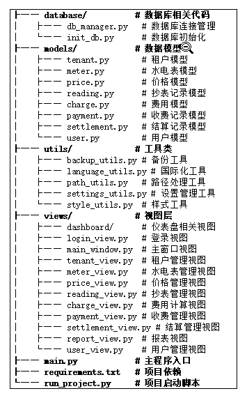


### 1.4 适用人群及环境要求

#### 1.4.1 适用人群

- **物业管理人员**：负责系统的日常维护和管理
- **水电抄表员**：负责记录水电表读数
- **财务人员**：负责费用计算、收费管理和结算工作
- **系统管理员**：负责系统配置和用户权限管理

#### 1.4.2 环境要求

| 项目       | 要求                                                                   |     
| -------- | -------------------------------------------------------------------- |   
| 操作系统     | Windows 7/8/10/11<br>macOS 10.15+<br>Linux (Ubuntu 20.04+，CentOS 7+) |    
| Python版本 | 3.11.0 或更高版本                                                         |     
| 内存       | 至少 2GB RAM                                                           |     
| 存储空间     | 至少 500MB 可用空间                                                        |     
| 分辨率      | 推荐 1024x768 或更高                                                      |     

### 1.5 系统个性特色

水电费抄收管理系统作为一款专为物业管理行业量身打造的智能化管理平台，在产品设计理念、技本架构实现和用户体验优化等多个维度都展现出了卓越的创新能力和显著的差异化优势。系统深度融合了现代信息技术的最新成果与管理科学的先进理念，不仅在功能完整性、易用性和安全性方面达到了行业领先水平，更在智能化程度、自动化水平和数据驱动决策能力方面实现了重大突破。

通过深入研究传统水电费抄收管理中存在的各种痛点和挑战，系统开发团队精心设计了八大核心特色模块，每个模块都承载着特定的创新价值和应用场景，形成了完整的产品生态系统。这些特色功能不仅能够有效解决物业管理企业在日常运营中遇到的实际问题，更能为企业数字化转型和智能化升级提供强有力的技术支撑和业务赋能，引领水电费抄收管理领域向更加高效、智能、便捷的方向发展。

以下详细阐述的八大核心特色，充分体现了系统在技术创新、功能优化、用户体验等方面的全面突破和卓越表现：

#### 1.5.1 全流程自动化管理
- **端到端自动化**：实现从抄表记录、费用计算到收费结算的全流程自动化处理，减少人工干预
- **智能费用计算**：系统自动根据抄表数据和价格策略计算费用，避免人工计算错误
- **状态自动更新**：缴费后自动更新费用状态，确保数据一致性
- **流程可视化**：清晰展示各环节的处理状态，便于监控和管理

#### 1.5.2 灵活的价格管理体系
- **多维度定价**：支持按租户类型、资源类型、时间周期等多维度设置价格
- **价格历史记录**：完整保存价格调整历史，便于追溯和审计
- **自动生效机制**：新价格按设定日期自动生效，无需手动切换
- **差异化定价**：可针对不同租户类型设置不同的水价和电价，满足复杂定价需求

#### 1.5.3 智能数据管理
- **批量数据处理**：支持批量导入抄表数据，提高工作效率
- **数据完整性校验**：自动校验抄表数据的合理性，防止异常数据录入
- **数据备份与恢复**：自动创建数据库备份，支持一键恢复，保障数据安全
- **数据导出多样化**：支持将各类数据导出为Excel格式，便于数据分析和报表生成

#### 1.5.4 精细化权限管理
- **多角色支持**：内置管理员、抄表员、财务等角色，各角色权限明确
- **细粒度权限控制**：可针对具体功能模块设置访问权限，确保数据安全
- **操作日志记录**：完整记录用户操作日志，便于审计和追溯

#### 1.5.5 国际化与本地化支持
- **多语言切换**：支持中英文语言切换，适应不同用户需求
- **本地化适配**：根据不同地区的水电计费规则进行适配
- **灵活的报表模板**：支持自定义报表格式，满足不同场景需求
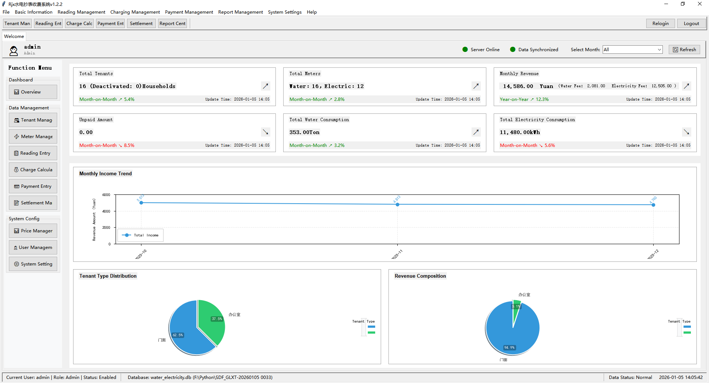

#### 1.5.6 友好的用户体验
- **直观的操作界面**：采用现代化的UI设计，界面简洁明了，易于上手
- **高效的查询功能**：支持多条件组合查询，快速定位所需信息
- **实时数据统计**：提供直观的数据统计和分析图表，辅助决策
- **响应式设计**：适配不同屏幕尺寸，提供良好的跨设备体验

#### 1.5.7 轻量级与高性能
- **低资源占用**：基于Python和SQLite开发，无需复杂的服务器配置
- **快速部署**：仅需安装Python环境即可运行，部署简单快捷
- **高性能处理**：优化的数据库设计和算法，确保系统运行流畅
- **跨平台支持**：支持Windows、macOS和Linux操作系统

#### 1.5.8 创新功能亮点
- **智能抄表提示**：根据设置的抄表周期自动提醒抄表任务
- **费用异常预警**：当费用出现异常波动时自动预警，便于及时核查
- **自动生成手抄单**：根据租户和水电表信息自动生成手抄单，方便现场抄表
- **收费凭证自动生成**：缴费后自动生成收费凭证，支持打印和保存

---

## 2. 操作手册

### 2.1 系统安装部署流程

#### 2.1.1 环境准备

1. **安装Python**
   - 访问Python官方网站 (https://www.python.org/downloads/)
   - 下载并安装Python 3.11.0 或更高版本
   - 安装时勾选"Add Python to PATH"

2. **验证Python安装**
   - 打开命令提示符或终端
   - 输入 `python --version`，确保显示Python 3.11.0 或更高版本
   - 输入 `pip --version`，确保pip已正确安装

#### 2.1.2 系统安装

1. **获取系统源码**
   - 从指定位置获取系统压缩包
   - 解压到本地目录，例如：`F:\Python\SDF_GLXT-20260105 0033`

2. **安装依赖**
   - 打开命令提示符或终端
   - 进入系统目录：`cd F:\Python\SDF_GLXT-20260105 0033`
   - 运行命令：`pip install -r requirements.txt`
   - 等待依赖安装完成

#### 2.1.3 系统启动

1. **直接运行**
   - 双击运行 `run_project.py` 文件
   - 或在命令行中运行：`python main.py`

2. **系统初始化**
   - 首次运行时，系统会自动初始化数据库
   - 创建所有必要的数据表
   - 添加默认管理员用户（用户名：admin，密码：admin123）
   - 添加默认水价和电价

### 2.2 用户注册与登录步骤

#### 2.2.1 登录界面

系统启动后，首先显示登录界面：

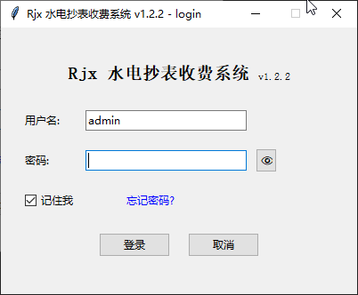


#### 2.2.2 登录步骤

1. **输入用户名和密码**
   - 默认管理员用户名：`admin`
   - 默认管理员密码：`admin123`
   - 输入后点击"登录"按钮

2. **登录验证**
   - 系统验证用户名和密码的正确性
   - 验证通过后，进入主系统界面
   - 验证失败时，显示错误提示

3. **首次登录建议**
   - 首次登录后，建议立即修改默认密码
   - 依次点击：`系统设置` → `用户管理` → 选择管理员用户 → `编辑`

#### 2.2.3 注册新用户

1. **权限要求**
   - 只有管理员权限才能注册新用户

2. **注册步骤**
   - 登录系统后，进入用户管理界面
   - 点击"添加"按钮
   - 填写用户信息：用户名、密码、角色
   - 点击"保存"按钮

### 2.3 功能模块操作说明

#### 2.3.1 租户管理

**功能说明**：管理租户信息，包括添加、编辑、删除租户，查看租户详情等。

**操作界面**：

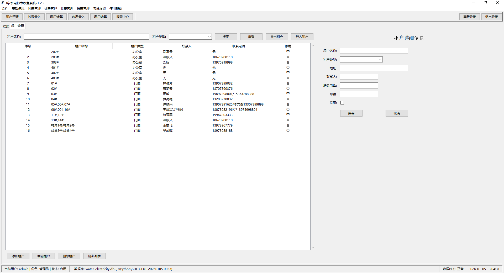


**操作步骤**：

1. **进入租户管理界面**
   - 点击左侧菜单栏中的"租户管理"按钮

2. **添加租户**
   - 点击"添加"按钮
   - 填写租户信息：租户名称、类型、地址、联系人、联系电话、邮箱
   - 点击"保存"按钮

3. **编辑租户**
   - 在租户列表中选择要编辑的租户
   - 点击"编辑"按钮
   - 修改租户信息
   - 点击"保存"按钮

4. **删除租户**
   - 在租户列表中选择要删除的租户
   - 点击"删除"按钮
   - 确认删除操作

5. **搜索租户**
   - 在搜索框中输入租户名称或其他关键词
   - 点击"搜索"按钮
   - 系统显示符合条件的租户列表

6. **导出租户数据**
   - 点击"导出租户"按钮
   - 选择保存位置
   - 系统生成Excel文件，包含所有租户信息

#### 2.3.2 水电表管理

**功能说明**：管理水电表信息，包括添加、编辑、删除水电表，分配给租户等。

**操作界面**：

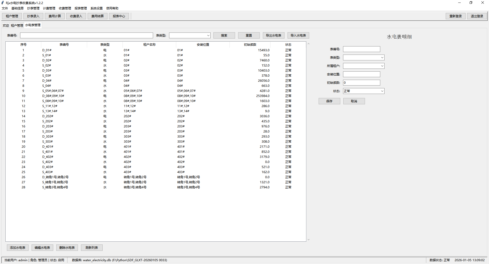


**操作步骤**：

1. **进入水电表管理界面**
   - 点击左侧菜单栏中的"水电表管理"按钮

2. **添加水电表**
   - 点击"添加"按钮
   - 填写水电表信息：表编号、表类型（水/电）、所属租户、安装位置、初始读数、状态
   - 点击"保存"按钮

3. **编辑水电表**
   - 在水电表列表中选择要编辑的水电表
   - 点击"编辑"按钮
   - 修改水电表信息
   - 点击"保存"按钮

4. **删除水电表**
   - 在水电表列表中选择要删除的水电表
   - 点击"删除"按钮
   - 确认删除操作

5. **搜索水电表**
   - 在搜索框中输入表编号、租户名称或其他关键词
   - 点击"搜索"按钮
   - 系统显示符合条件的水电表列表

#### 2.3.3 价格管理

**功能说明**：设置不同类型租户的水价、电价，支持价格调整和历史记录。

**操作界面**：

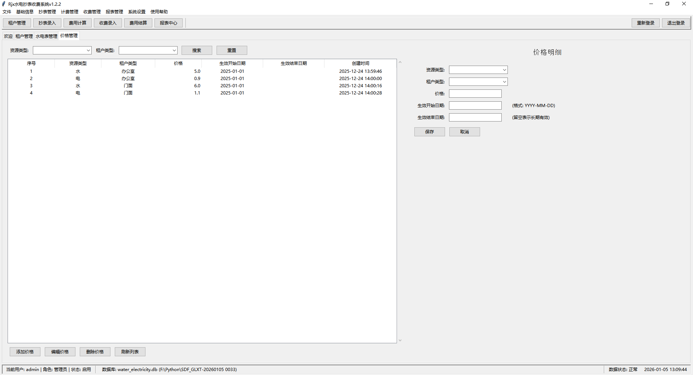


**操作步骤**：

1. **进入价格管理界面**
   - 点击左侧菜单栏中的"价格管理"按钮

2. **添加价格**
   - 点击"添加"按钮
   - 填写价格信息：资源类型（水/电）、租户类型、价格、生效开始日期
   - 点击"保存"按钮

3. **编辑价格**
   - 在价格列表中选择要编辑的价格
   - 点击"编辑"按钮
   - 修改价格信息
   - 点击"保存"按钮

4. **调整价格**
   - 点击"添加"按钮
   - 设置新的价格和生效日期
   - 系统自动处理价格的生效和失效

#### 2.3.4 抄表管理

**功能说明**：记录和管理水电表读数，支持手工录入和批量导入。

**操作界面**：

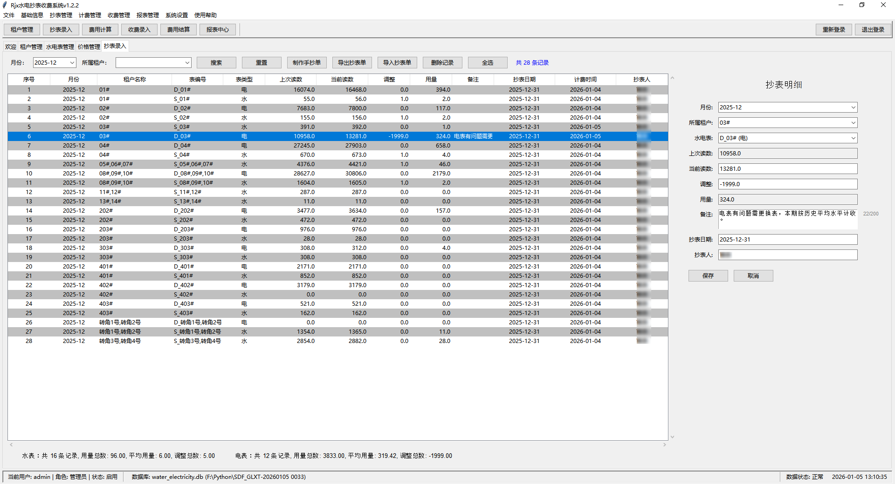


**操作步骤**：

1. **进入抄表管理界面**
   - 点击左侧菜单栏中的"抄表管理"按钮

2. **添加抄表记录**
   - 点击"添加"按钮
   - 选择月份、租户、水电表
   - 填写当前读数、上次读数、用量、调整值、抄表人
   - 点击"保存"按钮

3. **批量导入抄表数据**
   - 点击"导入抄表单"按钮
   - 选择预先准备好的Excel文件
   - 系统自动导入抄表数据

4. **导出抄表单**
   - 点击"导出抄表单"按钮
   - 系统生成空白抄表单，用于手工填写

5. **生成手抄单**
   - 点击"制作手抄单"按钮
   - 系统生成包含租户信息和水电表信息的手抄单

#### 2.3.5 费用计算

**功能说明**：根据抄表数据和价格自动计算租户费用，生成费用清单。

**操作界面**：

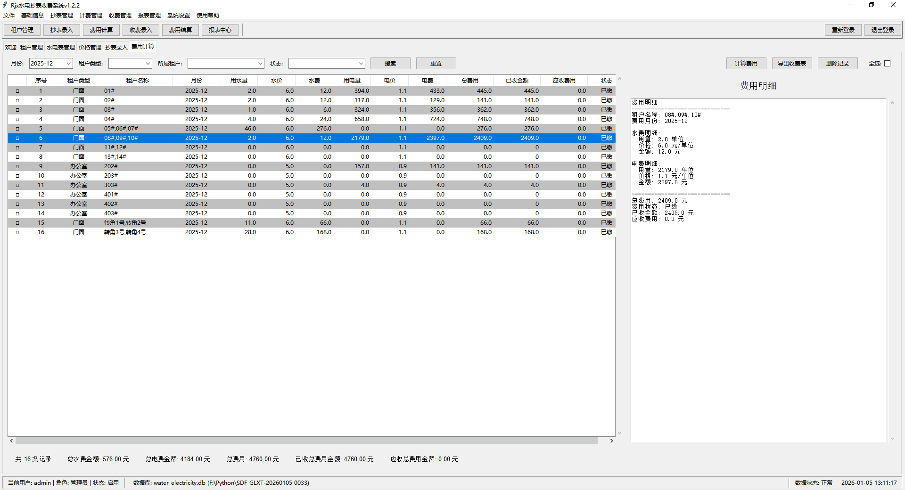


**操作步骤**：

1. **进入费用计算界面**
   - 点击左侧菜单栏中的"费用计算"按钮

2. **计算费用**
   - 选择要计算费用的月份
   - 点击"计算费用"按钮
   - 系统自动根据抄表数据和价格计算费用

3. **查看费用列表**
   - 计算完成后，系统显示所有租户的费用列表
   - 列表包含：租户名称、月份、用水量、水费、用电量、电费、总费用

4. **导出费用清单**
   - 点击"导出收费表"按钮
   - 选择保存位置
   - 系统生成Excel格式的费用清单

5. **筛选费用记录**
   - 使用筛选条件：月份、租户类型、租户、状态
   - 点击"搜索"按钮
   - 系统显示符合条件的费用记录

#### 2.3.6 收费管理

**功能说明**：记录租户缴费情况，支持多种缴费方式，自动更新费用状态。

**操作界面**：

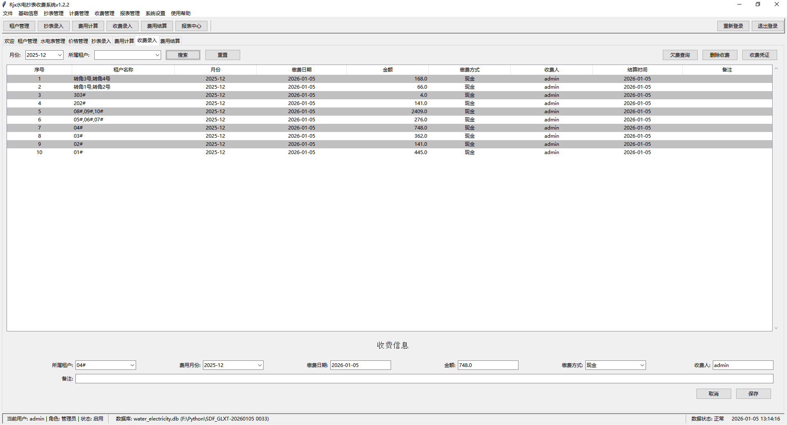


**操作步骤**：

1. **进入收费管理界面**
   - 点击左侧菜单栏中的"收费管理"按钮

2. **添加收费记录**
   - 点击"添加"按钮
   - 选择租户、费用月份
   - 填写缴费金额、缴费方式、收费人
   - 点击"保存"按钮

3. **查看收费记录**
   - 在收费记录列表中查看所有缴费情况
   - 列表包含：租户名称、缴费日期、金额、缴费方式、收费人

4. **生成收费凭证**
   - 选择一条收费记录
   - 点击"收费凭证"按钮
   - 系统生成收费凭证，可打印或保存

#### 2.3.7 结算管理

**功能说明**：月度结算，生成结算报表，支持Excel导出。

**操作界面**：

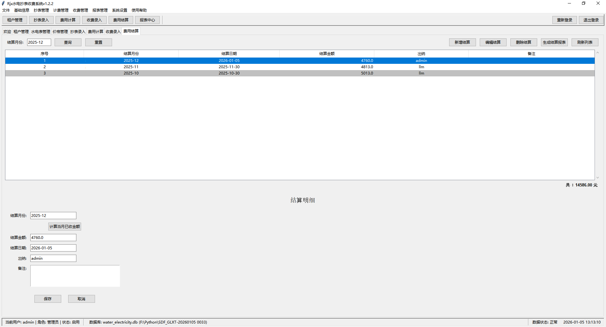


**操作步骤**：

1. **进入结算管理界面**
   - 点击左侧菜单栏中的"结算管理"按钮

2. **新增结算**
   - 点击"新增结算"按钮
   - 选择结算月份
   - 点击"计算当月已收金额"按钮
   - 系统自动计算当月已收金额
   - 填写结算信息：结算日期、出纳、备注
   - 点击"保存"按钮

3. **生成结算报表**
   - 选择一条结算记录
   - 点击"生成结算报表"按钮
   - 系统生成Excel格式的结算报表

#### 2.3.8 用户管理

**功能说明**：管理系统用户，包括添加、编辑、删除用户，分配用户角色等。不同的用户角色具有不同的权限。

**操作界面**：

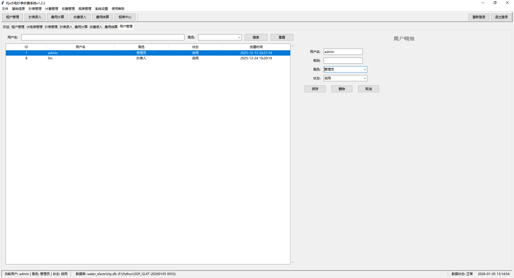


**操作步骤**：

1. **进入用户管理界面**
   - 依次点击：`系统设置` → `用户管理`

2. **添加用户**
   - 点击"添加"按钮
   - 填写用户信息：用户名、密码、角色
   - 点击"保存"按钮

3. **编辑用户**
   - 在用户列表中选择要编辑的用户
   - 点击"编辑"按钮
   - 修改用户信息
   - 点击"保存"按钮

4. **删除用户**
   - 在用户列表中选择要删除的用户
   - 点击"删除"按钮
   - 确认删除操作

#### 2.3.9 报表中心

**功能说明**：报表中心模块用于生成和管理各类水电费相关报表，包括月度报表、租户明细报表、收费统计报表等。用户可以根据需求设置筛选条件，生成不同类型的报表，并支持将报表导出为Excel格式。

**核心价值**：
- 提供直观的数据统计和分析，辅助管理层决策
- 简化报表生成流程，提高工作效率
- 支持多维度数据筛选，满足不同报表需求
- 便于数据归档和审计

**主要界面布局**：
- **顶部**：报表类型选择、筛选条件设置区域
- **中部**：报表生成按钮、数据预览区域
- **底部**：数据导出按钮、报表统计信息

**操作界面**：

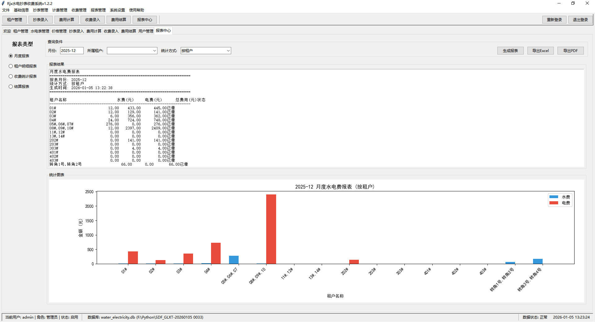
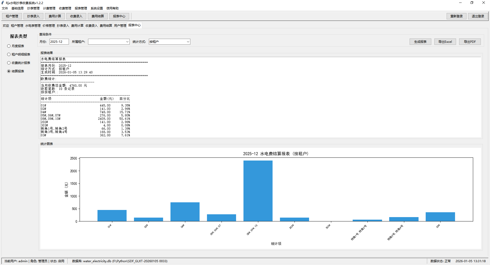
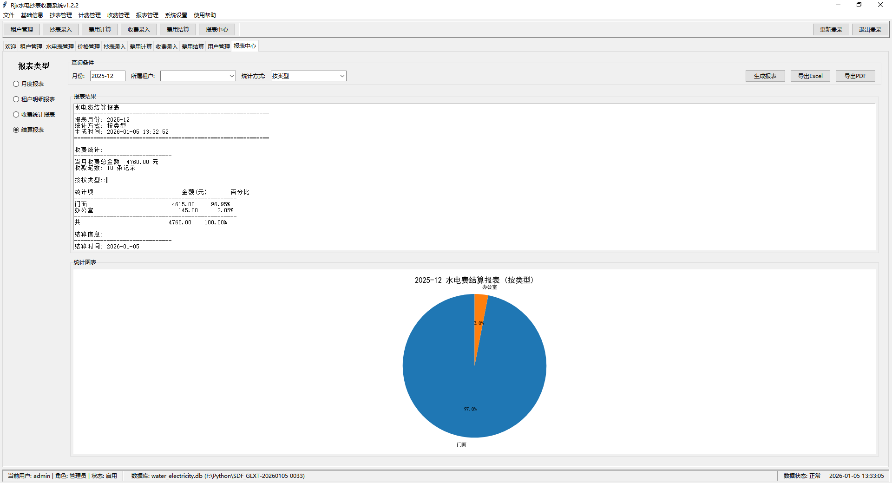


**操作步骤**：

1. **进入报表中心界面**
   - 点击左侧菜单栏中的"报表中心"按钮

2. **选择报表类型**
   - 在报表类型下拉框中选择要生成的报表类型：
     - 月度水电费报表
     - 租户水电费明细报表
     - 收费统计报表
     - 水电费结算报表

3. **设置筛选条件**
   - **报表月份**：选择要生成报表的月份
   - **租户类型**：可选，筛选特定类型的租户
   - **租户**：可选，筛选特定租户
   - **状态**：可选，根据费用状态筛选

4. **生成报表**
   - 点击"生成报表"按钮
   - 系统根据筛选条件生成报表
   - 报表数据将显示在预览区域

5. **查看报表数据**
   - 在预览区域查看生成的报表数据
   - 可以通过滚动条查看完整报表
   - 报表包含表头、数据行和合计行

6. **导出报表**
   - 点击"导出Excel"按钮
   - 选择保存位置
   - 系统生成Excel格式的报表文件
   - 导出完成后显示成功提示

7. **刷新报表**
   - 修改筛选条件后，点击"生成报表"按钮刷新报表
   - 或点击"刷新"按钮重新加载数据

**常见操作问题及解决方法**：

| 问题 | 可能原因 | 解决方法 |
|------|----------|----------|
| 报表数据为空 | 筛选条件设置不当 | 调整筛选条件，尝试更宽松的筛选范围 |
| 报表生成缓慢 | 数据量较大 | 减少筛选时间范围，或选择特定租户 |
| 导出Excel失败 | 权限不足或文件被占用 | 检查文件保存路径权限，关闭可能占用文件的程序 |
| 报表格式不正确 | 系统版本问题 | 更新系统到最新版本，或联系技术支持 |

**注意事项**：
- 生成报表前请确保已完成当月的抄表和费用计算
- 导出的Excel报表建议使用Microsoft Excel或WPS Office打开
- 定期备份重要报表，防止数据丢失
- 报表数据仅用于参考，正式财务报表以实际结算数据为准

### 2.4 常见问题处理及故障排除

| 问题现象 | 可能原因 | 解决方案 |
|---------|---------|----------|
| 登录失败 | 用户名或密码错误 | 检查用户名和密码是否正确，注意区分大小写 |
| 登录失败 | 用户账号被禁用 | 联系系统管理员启用账号 |
| 系统启动失败 | Python版本不兼容 | 确保安装Python 3.11.0或更高版本 |
| 系统启动失败 | 依赖未正确安装 | 重新运行 `pip install -r requirements.txt` |
| 数据库初始化失败 | 数据库文件权限问题 | 检查数据库文件是否有读写权限 |
| 导出Excel失败 | 未安装openpyxl | 运行 `pip install openpyxl` |
| 抄表数据导入失败 | Excel格式不正确 | 确保Excel文件格式符合要求，字段匹配 |
| 费用计算错误 | 抄表数据缺失 | 检查是否有完整的抄表记录 |
| 费用计算错误 | 价格设置不正确 | 检查价格设置是否合理，是否有生效的价格 |

### 2.5 数据备份与恢复

#### 2.5.1 数据备份

1. **自动备份**
   - 系统支持自动备份功能
   - 备份文件存储在 `backup/` 目录下
   - 默认保留最近3个备份文件
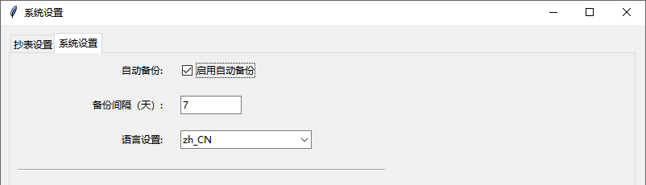
1. **手动备份**
   - 依次点击：`系统设置` → `数据备份`
   - 点击"备份"按钮
   - 系统创建数据库备份文件
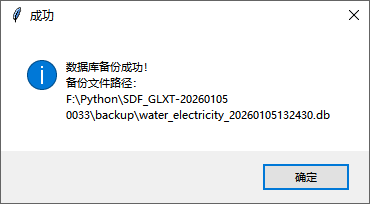
#### 2.5.2 数据恢复

1. **恢复数据**
   - 依次点击：`系统设置` → `数据恢复`
   - 选择要恢复的备份文件
   - 点击"恢复"按钮
   - 系统恢复数据并提示重启
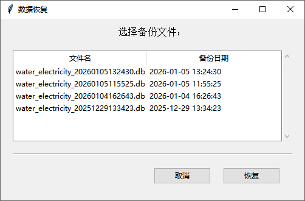
1. **注意事项**
   - 恢复数据会覆盖当前数据，请谨慎操作
   - 恢复前建议先进行手动备份
   - 恢复完成后需要重启系统

---

## 3. 术语解释

| 术语 | 解释 |
|------|------|
| 租户 | 使用水电资源的单位或个人 |
| 水电表 | 用于测量水、电使用量的计量设备 |
| 抄表 | 记录水电表当前读数的过程 |
| 用量 | 一定时期内的水电使用量，通常为当前读数减去上次读数 |
| 水价 | 每吨水的价格 |
| 电价 | 每度电的价格 |
| 费用计算 | 根据用量和价格计算应付费用的过程 |
| 缴费 | 租户支付水电费用的行为 |
| 结算 | 对一定时期内的费用和缴费情况进行汇总和核对 |
| 报表 | 以表格形式展示的数据汇总 |
| 角色 | 系统用户的权限级别，如管理员、抄表员、财务 |

---

## 4. 附录

### 4.1 快捷键说明

| 快捷键 | 功能 |
|--------|------|
| Ctrl + S | 保存当前数据 |
| Ctrl + F | 打开搜索框 |
| Ctrl + N | 新建记录 |
| Ctrl + E | 编辑当前记录 |
| Ctrl + D | 删除当前记录 |
| F5 | 刷新数据列表 |
| Ctrl + P | 打印当前内容 |

### 4.2 系统更新日志

| 版本 | 更新日期 | 更新内容 |
|------|----------|----------|
| V1.0 | 2026-01-05 | 初始版本发布 |
| | | - 实现租户管理、水电表管理、价格管理 |
| | | - 实现抄表管理、费用计算、收费管理 |
| | | - 实现结算管理、用户管理 |
| | | - 支持Excel导出功能 |
| | | - 支持中英文切换 |

---

## 5. 联系方式

如果您在使用过程中遇到问题或有改进建议，欢迎通过以下方式联系我们：

- 技术支持邮箱：lymin_li@qq.com
- 技术支持电话：18273949470
- 官方网站：[https://github.com/rjxerp/sdcbsf](https://github.com/rjxerp/sdcbsf)

我们将竭诚为您服务！

---

**文档编写日期**：2026-01-05
**文档版本**：V1.0
**文档作者**：lymin_li(吾已)

---

**版权声明**：本手册版权归水电费抄收管理系统开发团队所有，未经授权，不得复制、修改或传播。