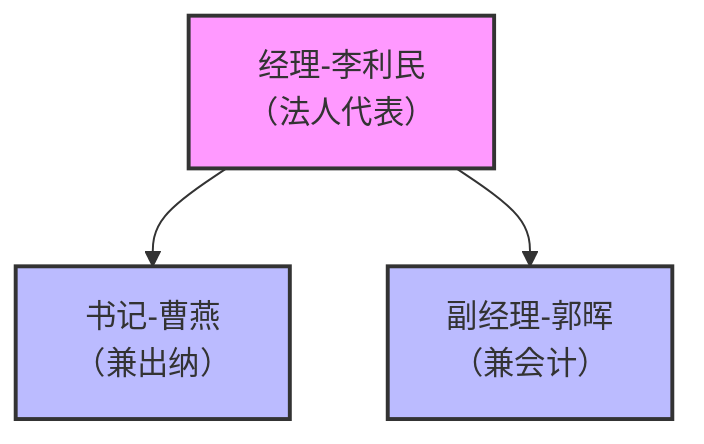

# 李利民先生自传

## 个人基本信息

| 项目 | 详情 |
|------|------|
| 姓名 | 李利民 |
| 身份 | 公司经理、法人代表 |
| 党内职务 | 党组织负责人（主持公司党组织工作） |
| 主要职责 | 全面负责公司运营管理，主持公司党组织工作 |

## 教育背景

由于现有资料中未明确提及李利民先生的详细教育背景，此处暂留待补充。

## 职业经历

### 现任职务
- **公司经理、法人代表**（2022年11月至今）
  - 全面负责公司运营管理
  - 主持公司党组织工作
  - 与书记曹燕、副经理郭晖组成三人管理团队

### 工作机制
1. **每周工作例会**（周一上午9:00-10:00）
   - 参会人员：李利民、曹燕、郭晖
   - 内容：总结上周工作，安排本周工作，讨论解决工作中遇到的问题

2. **每月党建工作会议**（每月最后一个周五下午2:30-4:00）
   - 参会人员：李利民、曹燕、郭晖（党员）
   - 内容：学习传达上级党组织文件精神，总结当月党建工作，安排下月党建工作

3. **每季度经营分析会议**（每季度最后一个月的25日下午2:30-4:30）
   - 参会人员：李利民、曹燕、郭晖
   - 内容：分析公司季度经营状况，总结经验教训，调整经营策略

## 主要职责与工作内容

### 1. 战略规划与经营管理
- 制定公司发展战略和年度经营计划
- 组织实施公司发展战略和年度经营计划
- 定期分析公司经营状况，调整经营策略
- 负责公司重大决策和对外关系协调

### 2. 党建党务工作
- 主持公司党组织工作
- 负责党风廉政建设和意识形态工作
- 组织开展党内政治生活

### 3. 安全综治工作
- 负责公司安全生产和社会治安综合治理工作
- 组织开展安全隐患排查与整改
- 负责突发事件应急处置的指挥工作

### 4. 资产运营工作
- 负责门面出租的整体规划和管理
- 审批重大租赁事项
- 协调处理重大租赁纠纷

### 5. 财务管理工作
- 审批公司重大财务事项
- 签署公司重要财务文件
- 负责公司资金的统筹管理

## 工作权限

1. **公司重大事项决策权**
2. **财务审批权**（超过一定金额的支出）
3. **人事任免权**
4. **对外签约权**

## 入党相关经历

- 提交入党申请书，积极向党组织靠拢
- 成为发展对象，接受党组织的考察和培养
- 完成党员发展流程，成为正式党员
- 担任党组织负责人，主持公司党组织工作

## 主要成就与贡献

### 1. 公司管理成就
- 建立了科学合理的岗位职责分工方案，确保公司各项工作得到全面、高效覆盖
- 严格遵循科学管理、职责明确、工作量均衡、科室设置简化、一人多职高效覆盖所有工作内容的原则
- 制定了完善的工作沟通协作机制，包括定期会议、日常沟通渠道和紧急事项处理流程

### 2. 党建工作贡献
- 加强公司党组织建设，提高党员素质
- 组织开展丰富的党内政治生活，增强党组织凝聚力
- 推进党风廉政建设，确保公司运营合规

### 3. 资产运营成果
- 优化门面出租管理，提高资产运营效率
- 维护良好的租户关系，确保租金稳定收取
- 妥善处理租赁纠纷，保障公司合法权益

### 4. 安全管理成效
- 建立健全安全管理制度，确保公司安全生产
- 组织开展安全隐患排查与整改，消除安全隐患
- 制定突发事件应急预案，提高应急处置能力

## 重要人生转折点

### 2022年11月：担任公司经理、法人代表
- 这是李利民先生职业生涯的重要转折点
- 标志着他开始全面负责公司运营管理
- 承担起更大的责任和使命

### 成为党组织负责人
- 这是李利民先生政治生涯的重要转折点
- 体现了党组织对他的信任和认可
- 使他能够在更高层面为公司和党员服务

## 个人理念与价值观

### 管理理念
- **科学管理**：遵循科学管理原则，优化工作流程，提高工作效率
- **职责明确**：明确岗位职责，避免职责重叠和工作遗漏
- **工作量均衡**：合理分配工作任务，确保团队成员工作量均衡
- **高效覆盖**：通过一人多职，高效覆盖所有工作内容

### 党建理念
- **从严治党**：严格要求党员，加强党风廉政建设
- **服务群众**：发挥党员先锋模范作用，服务公司发展和员工需求
- **与时俱进**：不断学习党的最新理论，提高党建工作水平

### 价值观
- **责任担当**：勇于承担责任，认真履行职责
- **诚实守信**：坚持诚实守信原则，维护公司良好形象
- **合规经营**：严格遵守法律法规，确保公司合规运营
- **团结协作**：重视团队协作，共同推动公司发展

## 社会评价及影响

### 公司内部评价
- 作为公司经理，李利民先生以身作则，严格要求自己，为员工树立了良好榜样
- 他具有较强的领导能力和决策能力，能够带领团队克服各种困难
- 他注重团队建设，关心员工生活，营造了良好的工作氛围

### 党组织评价
- 李利民先生党性强，政治觉悟高，能够认真贯彻执行党的路线方针政策
- 他具有较强的党建工作能力，能够创造性地开展党建工作
- 他廉洁自律，作风正派，是一名合格的党组织负责人

### 合作伙伴评价
- 李利民先生诚实守信，具有良好的商业信誉
- 他做事认真负责，能够积极履行合同义务
- 他具有较强的沟通协调能力，能够妥善处理各种合作关系

## 工作感悟与展望

### 工作感悟
- **责任重大**：作为公司经理和党组织负责人，深感责任重大，必须时刻保持清醒头脑
- **团队重要**：团队的力量是无穷的，只有团结协作，才能共同推动公司发展
- **学习永无止境**：要不断学习，提高自己的管理能力和党建工作水平
- **创新是动力**：要不断创新，适应新形势、新要求

### 未来展望
- 继续加强公司管理，提高公司运营效率和经济效益
- 进一步加强党建工作，提高党组织凝聚力和战斗力
- 优化资产运营，提高资产收益率
- 加强安全管理，确保公司安全生产
- 关心员工生活，提高员工福利待遇

## 附录

### 相关文件汇总

#### 党务文件
1. 入党申请书
2. 转正申请书
3. 关于发展对象李利民的综合审查报告
4. 关于将李利民同志进行发展对象备案的报告
5. 关于确定李利民同志为发展对象的公示
6. 关于审批李利民同志为中共预备党员的请示
7. 关于审批李利民同志为中共正式党员的请示
8. 关于确定李利民同志为正式党员的公示
9. 关于李利民入党有情况说明
10. 函调材料

#### 人事文件
1. 李利民副经理任命书
2. 李利民、郭晖任命书
3. 李利民-任免审批表-20221123

### 岗位职责分工方案

基于公司现有规模（在岗3人：经理-李利民（法人代表）、书记-曹燕（兼出纳）、副经理-郭晖（兼会计））及无法外聘人员的实际情况，制定了科学合理的岗位职责分工方案。

#### 组织结构图

## 结语

李利民先生作为公司经理和党组织负责人，始终以高度的责任感和使命感，认真履行职责，为公司发展和党建工作做出了重要贡献。他的管理理念、党建理念和价值观，为公司发展提供了强大的精神动力和智力支持。在未来的工作中，他将继续带领团队，不断创新，开拓进取，为公司发展和党建工作做出更大的贡献。

---

**撰写日期：** 2025年12月10日
**信息来源：** 基于本地库中相关文件整理而成
**备注：** 本自传根据现有资料整理，部分内容待补充完善